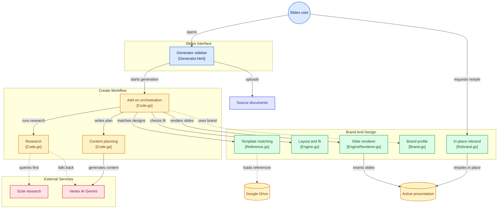

# 66° Deck Agent

Google Slides add-on that turns a prompt (and optional source documents) into **on-brand, editable** 66degrees slides **in the presentation that is already open**.

The uploaded V.1_17 specification is the source of truth. Gemini (or Vertex AI Gemini) writes the content plan; `ENGINE` lays out every slide on a 720×405 canvas; `EngineRenderer.gs` draws native Google Slides shapes into **the active presentation**.

## User flow

```
CURRENT GOOGLE SLIDES PRESENTATION
        ↓
sidebar (Extensions → 66° Deck Agent)
        ↓
Create pipeline
        ↓
research → plan → design → fit check → render
        ↓
slides inserted into THE SAME presentation
```

The sidebar “Open presentation” link is optional navigation. It is **not** how slides get into the deck. Generation never creates a second presentation on the default path (`CONFIG.useBeautifulAi` is `false`).

## Architecture



| File | Responsibility |
|---|---|
| `Code.gs` | Menu, settings, Create pipeline (research, plan, design choice, fit check), uploads, Gemini/Scite, orchestration |
| `Engine.gs` | Layout engine: every slide design, type scale, fit measurement |
| `EngineRenderer.gs` | Draws the engine layout into Google Slides (safe ShapeType / dimensions / text frames) |
| `Reference.gs` | 2026 template reference library, harvest, design rotation, icon check |
| `Brand.gs` | Brand colours, default brand profile, approved facts, Gemini/Vertex client |
| `Rebrand.gs` | Rebrand mode: restyles existing slides to the brand |
| `ShapeKit.gs` | Embedded rounded-rectangle shape kit (~3pt corners). Copy this file whole. |
| `Generator.html` | Sidebar: 66° Deck Agent UI (Create/Rebrand, type, department, 3–20 slides, prompt, upload, progress, Stop) |

Pipeline (Create):

```
research (Scite, else Gemini Search) → write plan → match 2026 template designs
  → fit check (ENGINE.measure) → draw into getActivePresentation()
```

Rebrand applies the brand pass to the open deck in place.

## Directory structure

```
66-deck-agent/
├── .github/workflows/deploy.yml
├── assets/
│   └── icons/
│       ├── manifest.json
│       ├── night-blue/
│       ├── white/
│       └── accent-blue/
├── src/
│   ├── appsscript.json
│   ├── Brand.gs
│   ├── ShapeKit.gs
│   ├── Engine.gs
│   ├── EngineRenderer.gs
│   ├── Reference.gs
│   ├── Rebrand.gs
│   ├── Code.gs
│   └── Generator.html
├── scripts/validate.js
├── tests/
├── .clasp.json
└── README.md
```

## Renderer safety

- `SlidesApp.ShapeType` names are normalized. `ROUNDED_RECTANGLE` maps to `ROUND_RECTANGLE`.
- Unknown AI-generated shape names fall back to `RECTANGLE`. All `insertShape` calls go through `insertShapeSafe_`.
- Every box uses `safeBox_`: width and height are finite and > 0.
- `getText()` / `getTextStyle()` run only on objects that have a text frame. Overlay text boxes hold labels.

## Setup

1. `npm ci`
2. `npm test`
3. Apps Script project: enable **Google Slides API** for the advanced Slides service. Drive access uses built-in `DriveApp` only — the add-on does **not** call `drive.googleapis.com` via `UrlFetchApp` (that path tries to enable the Drive API at runtime and fails for ordinary users). Manifest already requests:
   - `presentations`
   - `drive` (DriveApp file/folder access)
   - `script.external_request`
   - `script.container.ui`
   - `cloud-platform` (Vertex)
4. Script properties (Project Settings):

   Generation uses **Vertex AI OAuth only** (`ScriptApp.getOAuthToken()` → `Authorization: Bearer`). There is no Gemini API-key path.

   | Property | Required | Notes |
   |---|---|---|
   | `VERTEX_PROJECT_ID` | **Yes** | Linked Google Cloud project id (not the numeric GCP number from error messages) |
   | `VERTEX_LOCATION` | No | Default `us-central1` (or `global`) |
   | `VERTEX_MODEL` | No | Default `gemini-2.5-flash` |
   | `SCITE_API_KEY` | No | Academic research; Vertex Search/knowledge is the fallback |
   | `BEAUTIFUL_AI_KEY` | No | Unused unless `CONFIG.useBeautifulAi` is turned on |

   Also required on that Cloud project:
   - **Vertex AI API** enabled (`aiplatform.googleapis.com`)
   - Add-on users granted **Vertex AI User** (`roles/aiplatform.user`)
   - Re-authorize the add-on after the `cloud-platform` scope is added

5. First install/authorization runs `ensureInitialSetup_()`: it loads the 2026 reference library and any existing harvest runtime if they are already in Drive. Harvest/icon-check remain internal functions and are **not** shown on the Extensions menu.

The user-facing Extensions menu is:

- Open 66° Deck Agent
- Refresh brand kit
- Refresh brand assets

## Local validation

```bash
npm test
git diff --check
```

`npm test` runs `scripts/validate.js` then `tests/*.test.js`.

## Deploy

Push to `main` or:

```bash
gh workflow run deploy.yml --ref main
```

The workflow validates, `clasp push -f`, then updates the Apps Script deployment. GitHub secrets: `CLASPRC_JSON`, `SCRIPT_ID`, `DEPLOYMENT_ID`.

## Same-presentation contract

- Default Create calls `SlidesApp.getActivePresentation()` and `drawSlidesIntoActive_`.
- Blank decks are reused; decks with existing content get generated slides **appended**.
- Rebrand restyles the current deck.
- Completion payload includes that presentation’s `id` and `url`.
